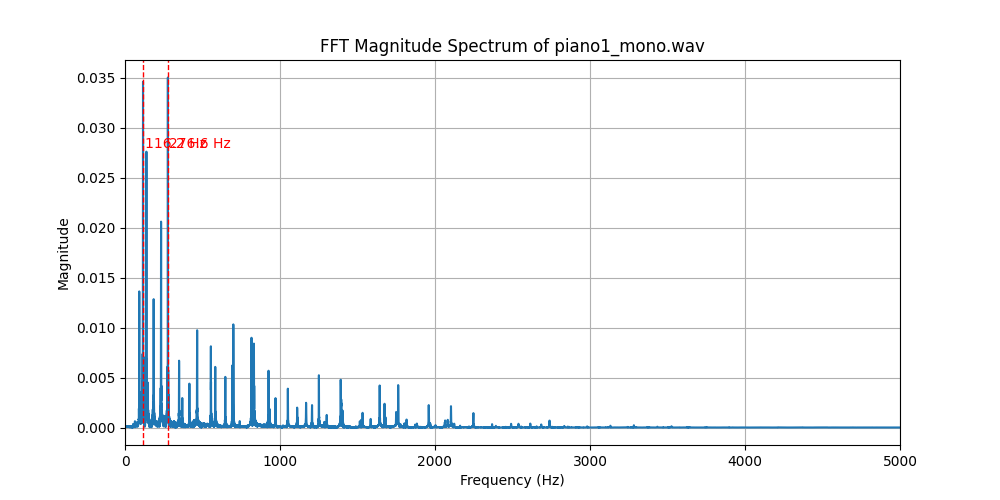
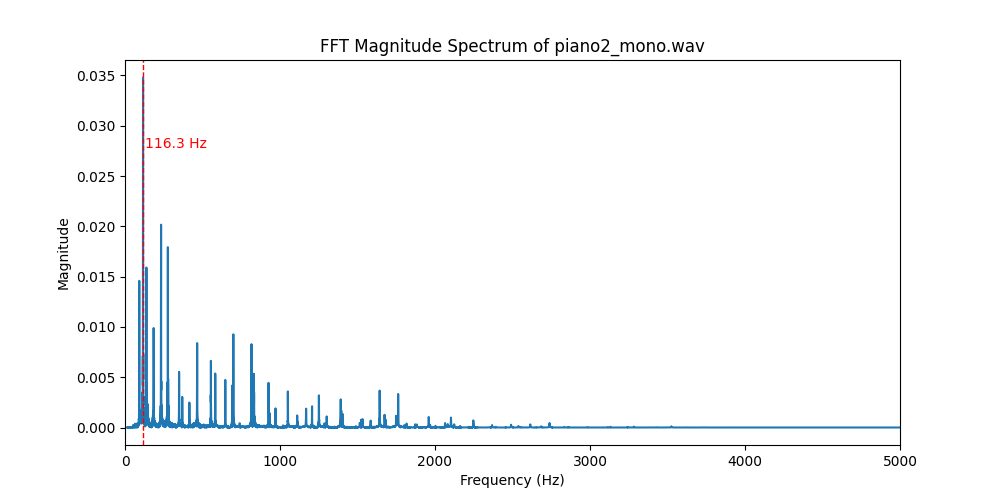
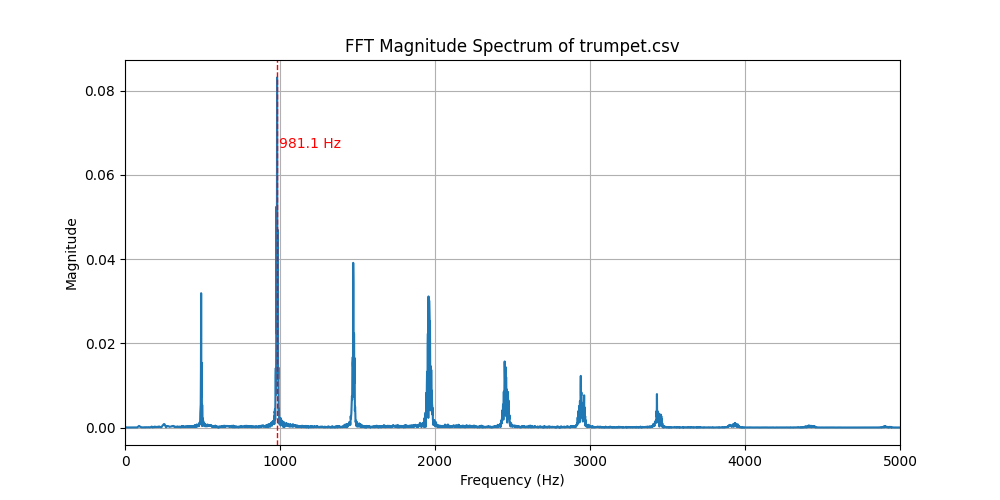
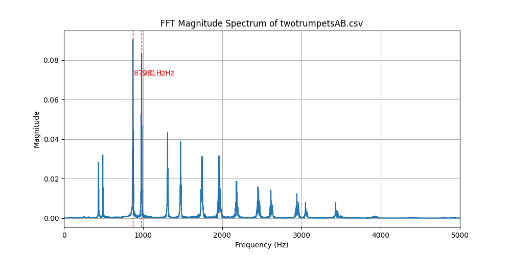

# Pitch Detection - Signals and Systems

| File Name            | Fundamental Frequency (Hz) | Simultaneous / Sequential | Notes |
|----------------------|----------------------------|----------------------------|-------|
| piano1_mono.wav      | 116.23, 276.598 | Sequential | Piano notes occur at different times, causing multiple sequential fundamental frequencies. |
| piano2_mono.wav      | 116.379         | Neither?   | Sequential piano notes are occuring at different times, but the FFT only shows one fundamental frequency for some reason. |
| trumpet.csv          | 981.107         | Neither    | A single fundamental frequency occurs due to a single trumpet emitting the sound signal. |
| twotrumpetsAB.csv    | 872.094, 981.107 | Simultaneous | Simultaneous multiple fundamental frequencies occur due to two different trumpets emitting a sound signal |

## Piano1 Harmonics

## Piano2 Harmonics

## Trumpet Harmonics

## TwoTrumpets Harmonics

## Techniques Used to Analyze the Data

This section describes the techniques I used to analyze the sound signals and how I used the numbered equations described below.

**(1):** The first step was to extract the data from the four sound signal files, two .csv files and two .wav files, into a **discrete-time signal**, formatted for Python signal analysis. I used numpy's `loadtxt()` function for the .csv files and SciPy's `wavfile.read()` function for the .wav files.

**(2):** The **discrete Fourier transform** was then performed on all four signals using SciPy's `fft()` algorithm.

**(5 & 6):** To normalize the signal data that was extracted from the .wav files, I used numpy's `abs()` function to get the **magnitude of the complex signals**, then divided the magnitude of the signals by `N` to **normalize the magnitudes**.

**(3):** The **FFT bins are then mapped to physical frequencies** for all four FFT signals using SciPy's `fftfreq()` function. The function uses **Equation (3)** to internally compute the results.

**(7):** Because these are real signals, only the real-side of the data matters and the second half of the data is redundant. Using the **Niquist limit**, we get only the first half of each FFT signal. This is shown in our code between lines 49 and 57.

### Equations Used During Analysis

$$
x[n], \quad n = 0, 1, 2, \dots, N-1
$$

**Equation (1):** Discrete-time signal obtained by sampling the continuous-time audio waveform.

$$
X[k] = \sum_{n=0}^{N-1} x[n] e^{-j 2\pi kn / N}
$$

**Equation (2):** Definition of the discrete Fourier transform (DFT).

$$
f_k = \frac{k F_s}{N}
$$

**Equation (3)**: Mapping FFT bin index to physical frequency.

$$
T_s = \frac{1}{F_s}
$$

**Equation (4):** Sampling interval in seconds per sample.

$$
|X[k]| = \sqrt{\Re\{X[k]\}^2 + \Im\{X[k]\}^2}
$$

**Equation (5):** Magnitude of the complex FFT output.

$$
|X_{\text{norm}}[k]| = \frac{|X[k]|}{N}
$$

**Equation (6):** Normalized FFT magnitude.

$$
0 \le f \le \frac{F_s}{2}
$$

**Equation (7):** Frequency range of the single-sided spectrum (Nyquist limit).

